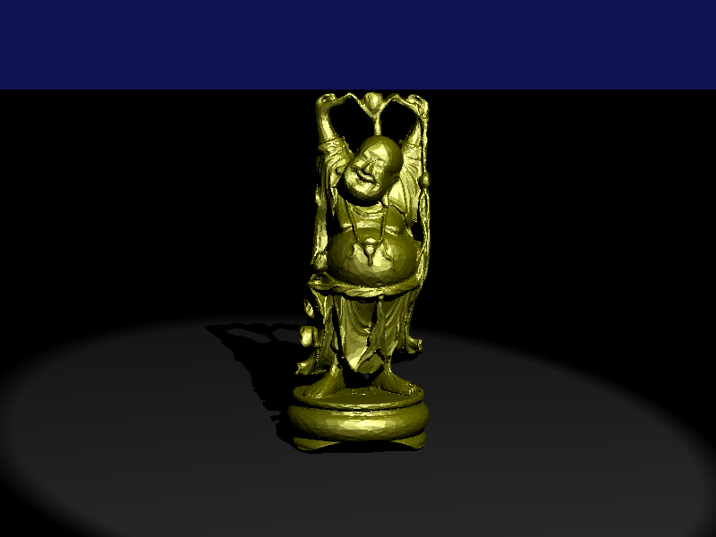

#Intro
A simple ray tracer written in Rust.

#Install rust
http://www.rust-lang.org/install.html

#Build & run
`cargo run --release` (that's all, really =)

#Overview

Project is at the early stage (as always), but the current structure is as
follows.

  * `libgeom/src/` -- basic geometric building blocks. A nice place to start
  reading. Also includes bounding volume hierarchy tree in `libgeom/src/shape/mesh`
  * `src` -- source code and some embedded test (`#[test]`)
  * `src/scene` -- a physical description of the scene, which integrates geometric
  shapes with materials, lights and colors.
  * `src/rendering` -- the rendering algorithm, which takes a `scene` and produces
    the `image`. `sampler` decides which rays to generate, `tracer` calculates
    radiance along the rays and `filter` incorporates results into a single 2D
    image.
  * `src/display` -- utilities to display the image (as PPM or to the console).

